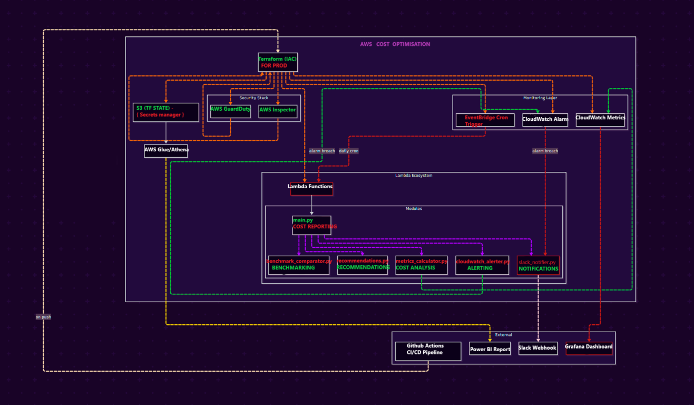

# AWS Cost Optimizer – DevSecOps + FinOps Project

[](https://github.com/nachiket-kumar/AWS-Cost-Optimization/actions)
[](https://terraform.io)
[](https://aws.amazon.com/lambda/)
[](LICENSE)

---

## 🧠 Overview

This is a **DevSecOps + FinOps** project to automatically monitor, optimize, and report on **AWS Cloud costs**.

It uses:
- 🧮 AWS Lambda + Terraform for cost monitoring
- 🔒 DevSecOps security (Inspector, GuardDuty, Trivy)
- 📊 Grafana + Power BI for visual cost reports
- 💬 Slack alerts for cost spikes
- ✅ Full CI/CD using GitHub Actions

---

## 🚀 Features

- **💸 AWS Cost Monitoring** via Lambda
- **📈 Slack Alerts** for spikes or budget overruns
- **🧮 Metric Publishing** to CloudWatch
- **📊 Dashboards**: Grafana (JSON) + Power BI (.pbix)
- **✅ CI/CD**: GitHub Actions
- **🔐 DevSecOps**: AWS Inspector + GuardDuty + Trivy
- **🛠️ Infrastructure as Code**: Terraform
- **📁 Modular structure** with tests, scripts, and automation

---

## 🏗️ Architecture Diagram



> Editable on [draw.io](https://draw.io) or Lucidchart.

---

## 📁 Folder Structure

```bash
aws-cost-optimizer-devsecops/
├── .github/                                # GitHub Actions (CI/CD)
│   └── workflows/
│       └── deploy.yml                      # Deploy pipeline

├── src/                                    # Lambda and cost logic
│   ├── cost_reporter/
│   │   ├── __init__.py
│   │   ├── main.py                         # Lambda handler
│   │   ├── slack_notifier.py
│   │   ├── metrics_calculator.py
│   │   ├── cloudwatch_alerter.py
│   │   ├── recommendations.py
│   │   ├── benchmark_comparator.py
│   └── scripts/
│       ├── install_dependencies.sh         # Shell setup
│       └── setup_cron.sh                   # Optional cron bootstrap

├── data/                                   # Benchmark and cost data
│   ├── cost_history.csv
│   ├── recommendations.json
│   └── industry_benchmarks.json

├── dashboards/                             # Visualizations
│   ├── grafana/
│   │   └── cost_dashboard.json
│   └── powerbi/
│       └── cost_report.pbix

├── tests/                                  # Unit + logic tests
│   ├── test_metrics.py
│   └── test_alerts.py

├── docs/                                   # Documentation
│   ├── ARCHITECTURE.md
│   ├── TROUBLESHOOTING.md
│   └── architecture.png

├── demo/                                   # Optional video
│   └── demo.mp4

├── terraform/                              # IaC for all infra
│   ├── main.tf
│   ├── variables.tf
│   ├── outputs.tf
│   ├── backend.tf                          # Remote S3 backend
│   └── security.tf                         # Inspector + GuardDuty

├── requirements.txt                        # Python/Lambda deps
├── README.md                               # This file
├── .gitignore
└── cost-report.txt                         # Sample monthly report
